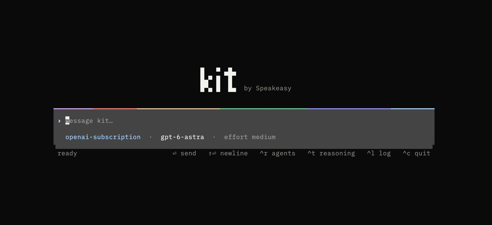
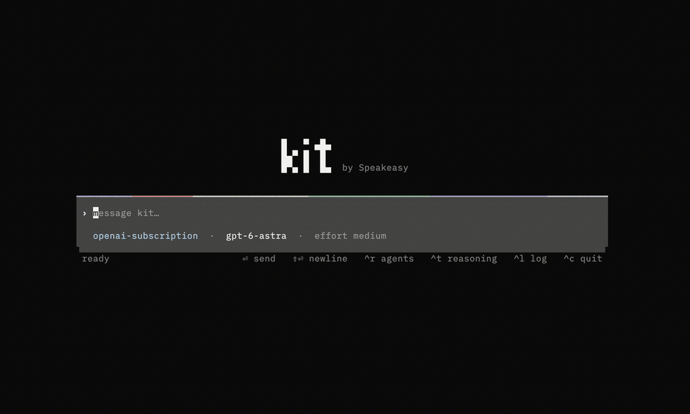
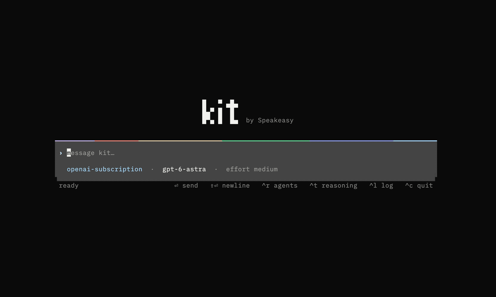
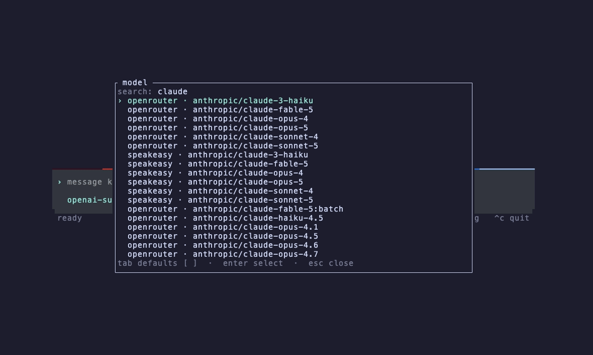
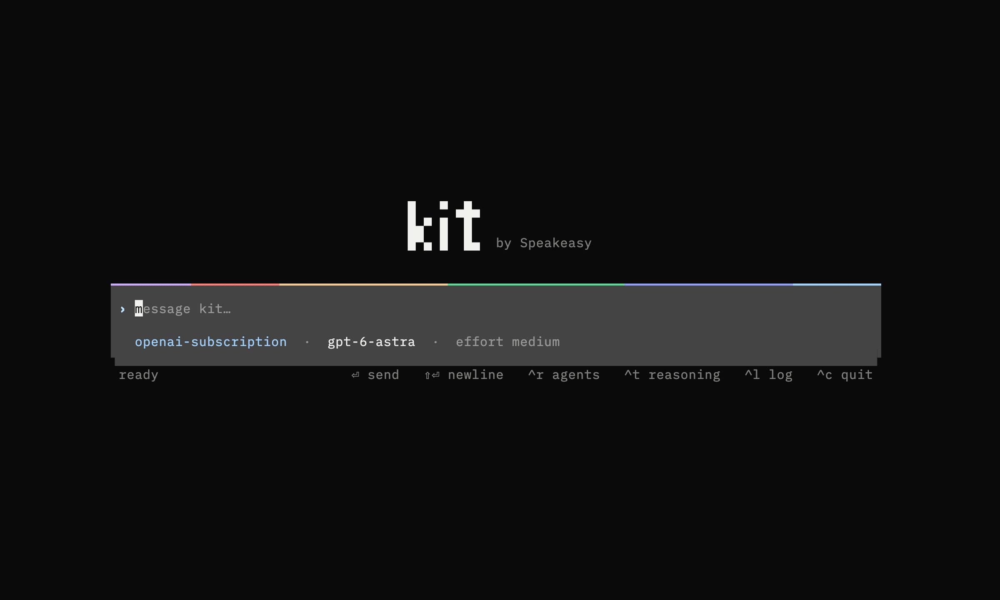
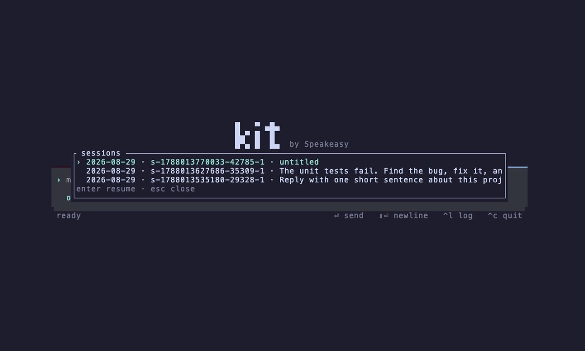

<p align="center">
  
</p>

<h1 align="center">Kit</h1>

<p align="center">
  A coding agent runtime that gives the model <strong>one tool</strong> and lets it write programs with it.<br>
  Terminal client, ACP server, A2A endpoint, and subagent orchestrator in a single static binary.
</p>

<p align="center">
  <a href="https://github.com/speakeasy-api/kit/releases"></a>
  <a href="https://github.com/speakeasy-api/kit/pkgs/container/kit"></a>
  <a href="https://github.com/speakeasy-api/kit/actions/workflows/ci.yml"></a>
</p>

```sh
curl -fsSL https://raw.githubusercontent.com/speakeasy-api/kit/main/install.sh | sh
kit init && kit auth login openai && kit tui
```

---

## Why Kit

Most agent harnesses expose many tools and pay one model round trip per call. Kit exposes **one tool, `compose`**, whose argument is a short program in [Runlet](https://github.com/danielkov/runlet). A single round trip can read several files, run the tests, apply an edit, retry a flaky command, delegate to subagents, and return one structured value.

This keeps requests small. In a comparison of real coding sessions run with Kit, Codex CLI, and Claude Code, the median API request under Kit carried **41k tokens** against 64k and 85k, and median peak context per session was **70k against 96k and 120k**. [How the comparison was made, and its limits.](#how-it-compares)

- **One tool, unlimited composition.** `shell`, `edit`, `subagent`, `prompt`, `fork`, `tool_search`, `tool`, `auth`, `skill`, `a2a`, `docs` are the tools a `compose` program calls. Independent calls run concurrently; data dependencies and `after` blocks express ordering; `boundary retry N` and `fail()` handle errors in-program.
- **Subagents are values, not fire-and-forget tasks.** Start one, prompt it again, fork it, require JSON that matches a schema, close it. Point it at another harness — Claude Code, Codex, Cursor, or Kit itself — over ACP.
- **Speaks the open protocols.** ACP v1/v2 over stdio, HTTP/SSE, and WebSocket for editors and clients; A2A v1 in both directions; MCP with live config reload and reactive OAuth; Agent Skills and Agent Plugin packages.
- **Built for long sessions.** Append-only JSONL transcripts synced before acceptance, automatic compaction at 80% of the context window, resumable from `tui`, `prompt`, or any ACP client, crash-safe locks, provider retries under a 24-hour deadline.
- **Bring your own model.** ChatGPT subscription via native OAuth, OpenRouter, or the Speakeasy AI Control Plane. Switch with `/model` mid-session.
- **Deliberately small.** No permissions framework, no sandbox, no web UI. `--root` is a working directory. Kit is a runtime, not a security boundary; run it inside one you already trust. [Trust model.](docs/user/security-limits-and-troubleshooting.md)

## Install

### Install script (macOS arm64, Linux x86-64)

```sh
curl -fsSL https://raw.githubusercontent.com/speakeasy-api/kit/main/install.sh | sh
```

Downloads the release tarball, verifies it against `SHA256SUMS`, and installs to `~/.local/bin`. `KIT_VERSION=v0.1.108` pins a release; `KIT_INSTALL_DIR` changes the destination.

<!-- PLACEHOLDER: record docs/media/install.gif — run the curl|sh line in a clean shell, then `kit --version`. The tape is in scripts/readme-media/install.tape; it only works once install.sh is on main. -->

### mise

```sh
mise use -g github:speakeasy-api/kit        # latest
mise use -g github:speakeasy-api/kit@0.1.108
```

### Docker

```sh
docker run --rm -it -v "$PWD:/workspace" -v ~/.kit:/home/kit/.kit \
  ghcr.io/speakeasy-api/kit:latest tui --credential-store file
```

Images are published for `linux/amd64` and `linux/arm64` in three flavors: `slim` (default, Debian slim), `bookworm`, and `alpine` (native musl build). Every release tags `v<version>`, `v<version>-slim`, `v<version>-bookworm`, `v<version>-alpine`; the newest stable release also moves `latest`, `slim`, `bookworm`, `alpine`. Images run as non-root `kit` (UID 1000) from `/workspace` and intentionally omit Git and language toolchains — extend them:

```dockerfile
FROM ghcr.io/speakeasy-api/kit:latest
USER root
RUN apt-get update && apt-get install -y --no-install-recommends git ripgrep && rm -rf /var/lib/apt/lists/*
USER kit
```

### From source

Requires the pinned Rust toolchain in `rust-toolchain.toml`.

```sh
git clone https://github.com/speakeasy-api/kit && cd kit
cargo build --release          # target/release/kit
scripts/sign-release.sh        # macOS only: sign before using the Keychain credential store
```

Release binaries for macOS are signed and notarized under `com.speakeasy.kit`. See [Releasing](docs/releasing.md).

## Quick start

```sh
kit init                                   # ~/.kit/config.toml + ~/.kit/mcp.json
kit auth login openai                      # ChatGPT subscription, native OAuth (PKCE)
kit tui --root /path/to/project            # interactive
kit prompt --root /path/to/project "Summarize this repo in three lines"   # one-shot, prints session_id
kit acp --root /path/to/project            # ACP over stdio for editors and clients
kit serve --root /path/to/project --remote-acp --no-a2a --no-stdio --http 0.0.0.0:8081 \
  --server-credential-file /private/token  # headless daemon
```

OpenRouter and Speakeasy work the same way: `kit auth login openrouter`, `kit auth login speakeasy`, then `--provider openrouter --model anthropic/claude-sonnet-5`. Credentials are shared by providers and MCP servers through one backend (`--credential-store keychain|file|memory`).

## Feature tour

### One tool: `compose`

The model writes a Runlet program. Kit renders the source live in the transcript while it runs — each call annotated idle/running/done, each binding waiting or resolved, loop and retry counters ticking — then replaces it with the result.

<p align="center"></p>

```text
tests   = shell({ command: "python3 -m unittest -q" })
counts  = for path in text.split(text.trim(shell({ command: "ls *.py" }).stdout), "\n") {
  return { path, lines: number.parse(text.trim(shell({ command: "wc -l < " + path }).stdout)) }
}
fixed   = after tests { return edit({ path: "calc.py", hunks: [ ... ] }) }
return { tests: tests.success, counts, fixed }
```

`tests` and `counts` run concurrently; `fixed` waits for `tests` via `after`. Hunk edits anchor on `context_before` / `old` / `context_after` and must match exactly once — no git required, atomic per file, permissions and CRLF preserved. Details: [Compose and local tools](docs/user/compose-and-local-tools.md).

### Subagents you can steer, continue, and fork

A subagent is a Runlet value with an `id`, `output`, and `generation`. Continue the same session with `prompt`, branch it with `fork`, list with `subagents({})`, stop with `close`. A stale generation is rejected, so two continuations can never race one session silently.

```text
review = subagent({
  harness: "acp.claude",
  prompt: "Review calc.py for edge cases.",
  output_schema: { type: "object", properties: { issues: { type: "array", items: { type: "string" } } }, required: ["issues"] }
})
ranked = prompt({ subagent: review, prompt: "Rank those issues by severity." })
alt    = fork({ subagent: ranked, prompt: "Now argue the opposite ranking." })
return { ranked: ranked.output, alt: alt.output, active: subagents({}) }
```

<p align="center"></p>

- **Any ACP harness.** `acp.kit` is built in. Add Claude Code, Codex, Cursor, or anything that speaks ACP v1 over stdio with four lines of TOML (below). Kit reads each harness's `initialize` response at runtime: native `session/fork` when advertised, isolated transcript fork for Kit children otherwise.
- **Structured output.** `output_schema` on any turn-producing call; malformed replies return raw text with the generation advanced, so the next `prompt` can repair.
- **Per-harness model aliases.** `[subagent.harnesses."acp.claude".models] architect = "opus"` lets the model ask for `model: "architect"` without knowing each harness's namespace; an `allow_model_overrides` list fences what it may pick.
- **Bounded.** Depth 2, 120 live subagents per session, 30-second startup handshake, permission requests from headless children are rejected or cancelled — never auto-approved.
- **Context is explicit.** Children start clean with the working directory, `AGENTS.md` chain, provider, MCP config, and credentials inherited (for `acp.kit`) and exactly the prompt you wrote. Skills load into a child on demand with `skill({ name })`.

Docs: [Reusable subagents and ACP harnesses](docs/user/subagents-and-acp-harnesses.md).

### Background work without losing the turn

Add `background: true` to a `compose` call and the program detaches; `background: 60` runs in the foreground for a minute first. The turn ends, the conversation continues, and the result is delivered back into the session when it lands. `⌘B` in the TUI backgrounds the newest running call; `^K` kills a selected one; the model can `close({ call_id })`.

<p align="center"></p>

### Steer a running turn

Press `⏎` while the agent is working and the message is injected into the *current* turn (ACP v2 `steer`), not queued behind it. `esc` interrupts, `^c` clears then quits.

<!-- PLACEHOLDER: record docs/media/steer.gif — start a longer task ("refactor calc.py into a class and add tests"), then while it is working type "actually keep it functional, just add docstrings" and press Enter. Capture the prompt placeholder changing from "message kit…" to "steer kit…" and the injected message appearing inside the running turn. -->

### Any model, one credential store

<p align="center"></p>

| Provider | Login | Notes |
| --- | --- | --- |
| `openai-subscription` | `kit auth login openai` | Native ChatGPT OAuth: PKCE + state + nonce, RS256 tokens validated against OpenAI's JWKS, loopback callback only. Refreshes five minutes before expiry, synchronized across processes. |
| `openrouter` | `kit auth login openrouter` or `OPENROUTER_API_KEY` | Live model catalog with context-window lookup for the gauge and compaction. |
| `speakeasy` | `kit auth login speakeasy` | Speakeasy AI Control Plane; Kit's session id maps to Gram's chat id so resumed conversations stay one thread. |

`/model sonnet` switches the live session at the next safe turn boundary; `tab` in the picker also rewrites `~/.kit/config.toml`. `/effort low|medium|high|default` does the same for reasoning effort.

### MCP that loads itself

No restart to add a server. Kit reloads `mcp.json` before every `tool_search` and `auth` call, waits for new servers to settle, then ranks tools across all of them. OAuth is inferred from the server's Bearer challenge — no `auth` block needed; the model calls `auth({ name })`, hands you a URL, and the session resumes itself when the browser flow completes. A rejected call after token expiry refreshes and replays once.

<p align="center"></p>

```json
{ "mcpServers": {
    "exa":    { "url": "https://mcp.exa.ai/mcp", "description": "Hosted web search" },
    "linear": { "url": "https://mcp.linear.app/mcp", "description": "Issues and projects" },
    "local":  { "command": "my-mcp-server", "args": ["--stdio"] } } }
```

Docs: [MCP](docs/user/mcp.md).

### Agent Plugins and Skills

Kit loads validated [Agent Plugin](docs/user/agent-plugins.md) packages from a local directory or a SHA-256-pinned ZIP / tar.gz / tar URL — a GitHub tag archive works as-is. Plugin skills join the `skill` catalog; plugin `stdio` and `streamable-http` MCP servers come up without an `mcp.json`. [Agent Skills](https://agentskills.io/) are discovered from `<root>/.agents/skills` and `~/.agents/skills` and disclosed progressively: names and descriptions first, the full `SKILL.md` only when loaded.

```toml
[plugins.review]
source = "path"
path = "./plugins/review"

[plugins.gram]
source = "archive"
url = "https://github.com/speakeasy-api/gram-plugin/archive/refs/tags/v1.2.0.tar.gz"
sha256 = "0123456789abcdef0123456789abcdef0123456789abcdef0123456789abcdef"
subdir = "plugin"
```

<!-- PLACEHOLDER: record docs/media/plugins.gif — with a plugin configured in ~/.kit/config.toml, start `kit tui` and ask "Which skills and MCP servers do you have from plugins? Load the review skill." Capture the skill catalog + plugin MCP server in tool_search's `mcp` status listing. -->

### Sessions that persist, resume, and compact

Every conversation is an append-only JSONL transcript under `~/.kit/sessions`, synced to disk before Kit accepts the item into memory. Resume from the TUI, from `kit prompt --resume`, or from any ACP client with `session/load` / `session/resume`. When the provider reports context at 80% of the window, Kit checkpoints older history into a structured note, keeps the bootstrap instructions and a tool-safe tail, and persists the replacement — `/compact` does it on demand.

<p align="center"></p>
<p align="center"></p>

<!-- PLACEHOLDER: record docs/media/long-session.png — resume a multi-hour session, send one small prompt, and screenshot the header once the gauge shows a high percentage (e.g. "78% 212k/272k"). Optionally a second frame right after the automatic checkpoint fires. -->

### Long-running and headless by design

- **Crash-safe.** One live process per session; a stale lock from a crashed process is reclaimed only when the OS proves nobody holds it (`--force`, or automatically when switching sessions in the TUI). An unanswered tool call is repaired with an explicit synthetic error result rather than a corrupted transcript.
- **Patient with providers.** Transient failures (408/425/429/5xx, transport, pre-first-token stream drops) retry with deterministic full-jitter backoff under a 24-hour deadline, reusing the same idempotency key. Auth, quota, and post-output failures stop immediately.
- **Daemon-friendly.** `kit serve --remote-acp --no-stdio` runs independently of stdin; `SIGINT`/`SIGTERM` stop new connections, interrupt live sessions, and drain for five seconds. One bearer token file guards the HTTP listener.
- **Observable.** `otel_endpoint = "http://localhost:4317"` exports AgentKit GenAI spans over OTLP/gRPC for the main agent, ACP sessions, nested children, and the compactor. Message capture is off by default and bounded when on.

Single Kit sessions have run for 4.7 hours of active work, 886 API requests, and 11 automatic compactions ([details](docs/harness-comparison.md)).

<!-- PLACEHOLDER: screenshot docs/media/otel-trace.png — point otel_endpoint at a local Jaeger/Tempo, run a session with two subagents, screenshot the trace waterfall showing the nested gen_ai spans. -->

### Terminal client

`kit tui` spawns `kit serve` and drives it over ACP — the client sees the same protocol any editor would. Highlights: drag-and-drop image and audio attachments (inline previews on Kitty/Sixel/iTerm2 terminals), click a code block to copy it, `^y` copies the last response as Markdown via OSC 52, `^l`/`^t` toggle the agent log and reasoning, `^o` folds tool output. Full key table in [TUI and sessions](docs/user/tui-and-sessions.md).

### Editors and other clients over ACP

Anything that speaks ACP can drive Kit: `kit acp` for stdio, or `kit serve --remote-acp` for HTTP/SSE and WebSocket at `/acp` (`/acp/v2` for v2-only clients). Kit also answers A2A v1 at the same listener and can call other A2A agents with `a2a({ url, prompt })`.

<!-- PLACEHOLDER: screenshot docs/media/acp-editor.png — Kit running as an external agent inside an ACP-capable editor (e.g. Zed: add {"agent_servers": {"Kit": {"command": "kit", "args": ["acp", "--root", "."]}}} to settings.json). Show a prompt with a compose tool card rendered by the editor. -->

## Configuration

`kit init` writes this; command-line flags override it.

```toml
provider = "openai-subscription"   # openrouter | speakeasy
model = "gpt-5.6-sol"
reasoning_effort = "high"
credential_store = "file"          # memory | keychain | file
credential_dir = "~/.kit/credentials"
mcp_config = "~/.kit/mcp.json"
otel_endpoint = "http://localhost:4317"

[acp.claude]
command = "npx"
args = ["-y", "@agentclientprotocol/claude-agent-acp@0.69.0"]
permissions = "deny"               # deny (default) | cancel — Kit never auto-approves

[acp.codex]
command = "npx"
args = ["-y", "@agentclientprotocol/codex-acp@1.4.0"]

[acp.cursor]
command = "cursor-agent"
args = ["acp"]

[subagent]
harness = "acp.kit"

[subagent.harnesses."acp.claude".models]
architect = "opus"

[subagent.harnesses."acp.kit".models]
flash = "openrouter:openai/gpt-5.6-luna"
```

`AGENTS.md` files from the working directory and its ancestors are loaded as project instructions. Everything else: [Getting started and configuration](docs/user/getting-started-and-configuration.md).

## How it compares

The numbers below were computed from the session transcripts of one developer who used all three tools for day-to-day work: 144 Kit, 374 Codex CLI, and 344 Claude Code sessions plus their subagents, recorded between October 2025 and August 2026. They are observational, not a benchmark: different models, different tasks, different months. The scripts and the full report with matched task families are in [docs/harness-comparison.md](docs/harness-comparison.md).

| Median per session | Kit | Codex CLI | Claude Code |
| --- | ---: | ---: | ---: |
| Input tokens per API request | **41k** | 64k | 85k |
| Peak context | **70k** | 96k | 120k |
| Input tokens per assistant turn | **460k** | 927k | 696k |
| Tool calls per turn | 8.5 (compose; ~1.65 inner calls each) | 19.0 | 8.9 |
| Sessions using subagents | **36%** | 2% | 18% |
| Max subagent nesting observed | 2 | 2 | 1 |

On the closest matched family — shipping a Linear issue end-to-end in the same repository — total spend was the same order of magnitude for all three (~45M input tokens median), while Kit's peak context stayed lowest (266k) despite the smallest window (272k) and 20–34 subagents per run. Kit is not cheaper per task in this sample; it spends the budget in smaller, more parallel requests. See the [caveats](docs/harness-comparison.md#caveats) before drawing conclusions.

<!-- PLACEHOLDER: optional chart docs/media/comparison.svg — bar chart of the "input tokens per API request" and "peak context" rows; generate from scripts/harness-comparison/analyze.py output. -->

## Deliberate limits

The root is a working directory, not a sandbox: `shell` has the host's authority and `edit` accepts absolute paths. Edits are atomic per file, not per turn. Subagents are child processes sharing the root, bounded to depth two. Background compose calls live as long as the Kit process. Without `--server-credential-file` the HTTP listener has no authentication — never expose it beyond loopback. There is no plan to add an approval framework; run Kit inside a boundary you already trust, such as a container, a VM, or a CI runner.

## Documentation

- [Getting started and configuration](docs/user/getting-started-and-configuration.md)
- [Compose and local tools](docs/user/compose-and-local-tools.md)
- [Reusable subagents and ACP harnesses](docs/user/subagents-and-acp-harnesses.md)
- [MCP](docs/user/mcp.md)
- [Agent Plugins](docs/user/agent-plugins.md)
- [TUI and sessions](docs/user/tui-and-sessions.md)
- [Security, limits, and troubleshooting](docs/user/security-limits-and-troubleshooting.md)
- [Harness comparison](docs/harness-comparison.md)
- [Releasing](docs/releasing.md) · [Third-party notices](THIRD_PARTY_NOTICES.md)

The same docs are compiled into the binary; the agent searches them with `docs({ query })`.

## Reporting issues

[speakeasy-api/kit/issues](https://github.com/speakeasy-api/kit/issues). Include the Kit version and follow the [reporting guide](docs/user/reporting-kit-issues.md). Agents must ask before filing on your behalf.
